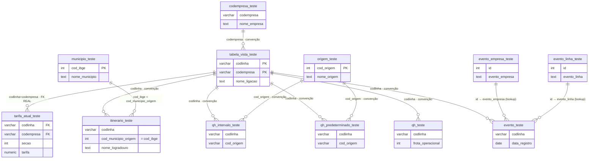

# Relação das Tabelas — Portal DIVAT (`bd_teste`)

Mapa **relacional** do banco: como as tabelas se ligam entre si, por qual chave, e se a
ligação é uma **FK real** (garantida pelo banco) ou uma **convenção** (join feito no código
do `app.js`, sem constraint no banco). Complementa a tabela *"Tabelas → onde aparecem
(cards)"* do `CLAUDE.md`, que é o mapa **funcional** (qual tela lê qual tabela).

> **Por que este arquivo existe:** quase todas as ligações deste banco são **implícitas** —
> só **uma FK é declarada** (`fk_tarifa_linha`). O resto do "esquema" vive espalhado dentro
> dos `loader()` do `app.js`. Este doc torna isso explícito, para reconstrução de dados,
> conferência e para qualquer sessão futura (humana ou IA) entender os joins sem reler ~3,2
> mil linhas de JS. Gerado do schema **ao vivo** (Supabase) + os joins reais do frontend.

## Visão geral — hub-and-spoke

`tabela_vista_teste` (cadastro de linhas) é o **hub**. Praticamente tudo se liga a ela por
**`codlinha`**. Em volta há tabelas-fato (itinerário, quadros, tarifa, frota, eventos) e
tabelas-dimensão/lookup (empresa, origem, município).

## Relações — detalhe

### Hub
| Tabela | PK | Papel |
|---|---|---|
| `tabela_vista_teste` | (`codlinha`, `codempresa`) | Cadastro de linhas. **Hub** — origem do `codlinha` que amarra tudo. |

### Fatos (ligam ao hub por `codlinha`)
| Tabela | Chave de join → hub | Tipo | Onde no código (`app.js`) |
|---|---|---|---|
| `tarifa_atual_teste` | `codlinha` (+`codempresa`) | **FK REAL** `fk_tarifa_linha` | `renderTarifas`, `renderFolhaRosto`, `renderLinhaQuadro` |
| `itinerario_teste` | `codlinha` | convenção | `renderItinerarios` |
| `qh_intervalo_teste` | `codlinha` | convenção | `fetchQHByLines`, `renderLinhaQuadro` |
| `qh_predeterminado_teste` | `codlinha` | convenção | `fetchQHByLines`, `renderLinhaQuadro` |
| `qh_teste` (frota) | `codlinha` | convenção | `renderFrota`, folha de rosto |
| `evento_teste` | `codlinha` | convenção | `renderLineHistory`, pesquisa de evento |

> **`fk_tarifa_linha` é composta e "cruzada":** a constraint declara os dois pares
> (`codlinha`↔`codlinha` e `codempresa`↔`codempresa`) contra a PK `(codlinha, codempresa)`
> de `tabela_vista_teste`. É a **única** integridade referencial garantida pelo banco; todo o
> resto depende dos dados virem consistentes do ETL do dono.

### Dimensões / lookups
| Tabela | PK | Ligada de | Por | Tipo |
|---|---|---|---|---|
| `codempresa_teste` | `id`; `codempresa` único **por convenção do ETL** (índice btree não-UNIQUE `idx_codempresa_codempresa` — o banco NÃO garante) | `tabela_vista_teste`, `qh_teste`, `evento_teste`, `itinerario_teste` | `codempresa` | convenção — resolve nome da empresa (`empNome`/`getEmpresas`) |
| `origem_teste` | `cod_origem` | `qh_intervalo_teste` (`cod_origem`), `qh_predeterminado_teste` (`cod_origem`) | `cod_origem` | convenção — nome do terminal/origem (`origemMap`) |
| `municipio_teste` | `cod_ibge` | `itinerario_teste` (`cod_municipio_origem`) | `cod_ibge` | convenção — nome do município (`ibgeMap`/`getIbge`) |
| `evento_empresa_teste` | `row_id` (`id`) | `evento_teste` | `id` | convenção — descrição do evento de empresa (`getEvLookups`→`evLookups.emp`) |
| `evento_linha_teste` | `row_id` (`id`) | `evento_teste` | `id` | convenção — descrição do evento de linha (`getEvLookups`→`evLookups.lin`) |
| `localidades_teste` | `ordem_importacao` | — (lista de referência) | texto | convenção — "Linhas por Localidade e Município" |
| `portaria_teste` | `id` | — (documento independente) | — | legislação/portarias |

## ⚠️ Armadilhas de nomenclatura (não confundir)

- **`cod_origem` (terminal) × `cod_municipio_origem` (município) — desambiguado em 17/07/2026:**
  - Em `qh_intervalo_teste` e `qh_predeterminado_teste` → `cod_origem` = **terminal/origem** →
    `origem_teste`. (O typo histórico `cod_origen`, com N, em `qh_intervalo_teste` foi **corrigido**
    para `cod_origem` na mesma mudança.)
  - Em `itinerario_teste` → a coluna que antes se chamava `cod_origem` foi **renomeada** para
    **`cod_municipio_origem`** (tipo `int`): **NÃO é terminal** — o código faz
    `ibge[r.cod_municipio_origem]`, ou seja, é um **código de município (IBGE)** → `municipio_teste`
    (ver `renderItinerarios` / `classifyMunLines` no `app.js`).
- **`codlinha` e `codempresa` são strings** (`varchar`), não inteiros — comparar/encodar
  como texto nas queries.
- **`nome_origem` vem denormalizado e às vezes trocado** nas tabelas de QH; o código dá
  prioridade ao nome autoritativo de `origem_teste` (ver comentário em `quadroHorariosBodyHTML`).

## Tabelas de staging do ETL (o portal NÃO lê)

Alimentam as tabelas finais via service role (painel Supabase). Têm RLS ligado **sem policy**
e sem grant para `anon`/`authenticated` → invisíveis pela API pública, de propósito. O lint
`rls_enabled_no_policy` nelas é **esperado**.

| Staging | Junta com | Por | Monta a final |
|---|---|---|---|
| `evento_dados` | `evento_textos` | `id` | → `evento_teste` |
| `portaria_data` | `portaria_texto_teste` | `id` | → `portaria_teste` |

## Contagem de linhas (referência — snapshot 15/07/2026)

| Tabela | Linhas | | Tabela | Linhas |
|---|--:|---|---|--:|
| `itinerario_teste` | 52.146 | | `qh_intervalo_teste` | 9.598 |
| `qh_predeterminado_teste` | 23.838 | | `tarifa_atual_teste` | 3.488 |
| `evento_teste` | 20.753 | | `portaria_teste` | 2.100 |
| `tabela_vista_teste` | 1.869 | | `qh_teste` | 1.490 |
| `localidades_teste` | 752 | | `origem_teste` | 548 |
| `codempresa_teste` | 133 | | `municipio_teste` | 92 |
| `evento_linha_teste` | 82 | | `evento_empresa_teste` | 51 |
</content>
</invoke>
